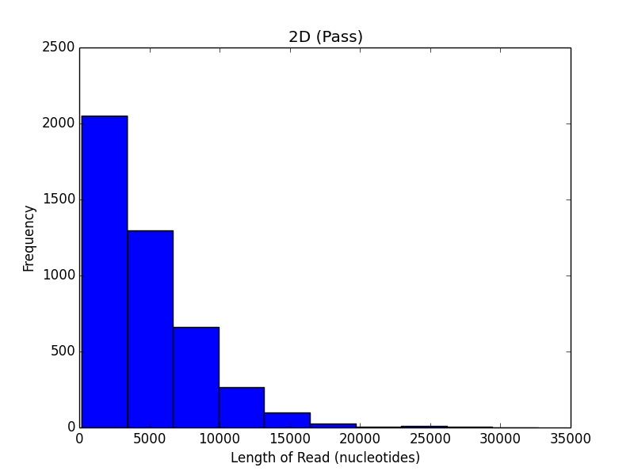

## Ubiquitous Genomics Hackathon #2: CSI Columbia

Group #3: The Minnows
 - Alex Kalicki (avk2116)
 - Boyu Wang (bw2387)
 - Lilly Wang (lfw2114)
 - Tia Zhao (tz2191)

### Question 1

As instructed, we calculated the number of 2D reads classified as "passed"
versus the number classified as "failed". We obtained the following results:

 - Passed: 4423 2D reads
 - Failed: 2544 2D reads

### Question 2

- Average reads per channel: 65
- Channel with most reads: 295
- Number of reads in Channel 295: 618

### Question 3

The cumulative nucleotides from "passed" and "failed" 2D reads are plotted below
as a function of time.

Cumulative "passed" nucleotides:

Cumulative "failed" nucleotides:

Using poretools, the results for 1D reads were null for pass and fail folders. (For
instance, the command "poretools stats --type fwd,rev pathtofast5files" yielded null as well as
"poretools fasta --type fwd,rev pathtofast5files"). The cumulative nucleotides were calculated
by running the command "poretools stats", getting the total base pairs for each file and the file's
timestamp, and multiplying the total base pairs by 2. 

### Question 4
The following histograms depict the length distributions of 2D reads in
the failed and passed folders.

### Question 5
The following table shows the longest reads for the 2D strands:

| Type       | Longest Read (nucleotides) |
|------------|----------------------------|
| Pass  	 | 32671                      |
| Fail 		 | 26815                      |

### Question 6
Using samtools, we were able to find how many reads aligned by using:
<pre><code>samtools view -c align.sam</code></pre> 
9653 reads were aligned using this tool.

### Question 7

### Question 8

Strategies to reduce errors in reads:  
1) Imputation. According to [Pasaniuc et al., 2012](http://www.ncbi.nlm.nih.gov/pmc/articles/PMC3400344/), using imputation with the 1000 Genomes dataset, extremely low coverage sequencing (such as the MinION sequencer) can achieve power comparable to "in principle achieve power comparable to high-density SNP arrays." We could use the imputation server [here](https://imputationserver.sph.umich.edu/index.html).  
2) Select only 2D high-quality reads for processing to reduce the probability of errors in the reads. Then, post-alignment, remove duplicate reads. According to [Sims et al., 2014](https://rtsf.natsci.msu.edu/_rtsf/assets/File/depth%20and%20coverage.pdf), duplicate read removal ensures that errors that are introduced and amplified during sequencing do not result in erroneous calls.   
3) Since genomic regions with repetitive DNA sequences are prone to incorrect mapping to the reference genome, one way to reduce errors is to filter them from the reads. We can do this by retrieving all repetitve DNA sequences from a genome browser and developing a filter for it. According to [Reumers et al., 2014](http://www.nature.com/nbt/journal/v30/n1/full/nbt.2053.html) filters targeting tandem repeats, microsatellites and homopolymer regions were most selective. 
