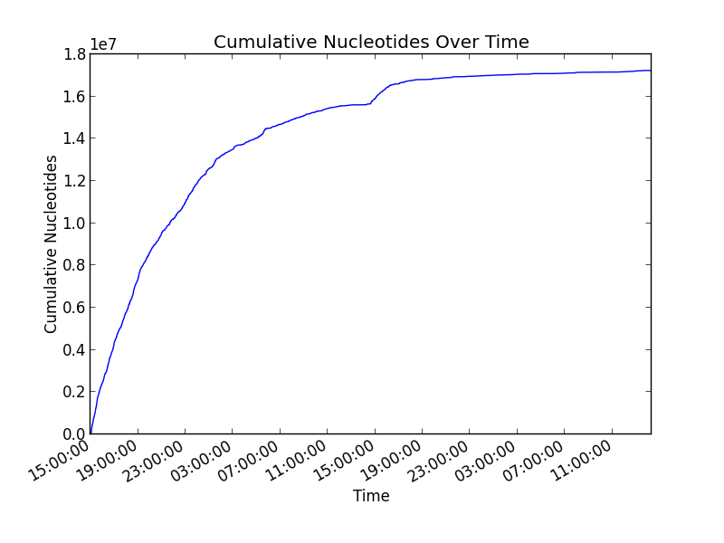

## Ubiquitous Genomics Hackathon #2: CSI Columbia

Group #3: The Minnows
 - Alex Kalicki (avk2116)
 - Boyu Wang (bw2387)
 - Lilly Wang (lfw2114)
 - Tia Zhao (tz2191)

### Question 1

As instructed, we calculated the number of 2D reads classified as "passed"
versus the number classified as "failed". We obtained the following results:

 - Passed: 4423 2D reads
 - Failed: 2544 2D reads

### Question 2

### Question 3

The cumulative nucleotides from "passed" and "failed" 2D reads are plotted below
as a function of time.

Cumulative "passed" nucleotides:

Cumulative "failed" nucleotides:

Using poretools, the results for 1D reads were null for pass and fail folders. (For
instance, the command "poretools stats --type fwd,rev pathtofast5files" yielded null as well as
"poretools fasta --type fwd,rev pathtofast5files"). The cumulative nucleotides were calculated
by running the command "poretools stats", getting the total base pairs for each file and the file's
timestamp, and multiplying the total base pairs by 2. 

### Question 4

### Question 5

### Question 6

### Question 7

### Question 8

Strategies to reduce errors in reads:
1) Imputation. We could use the imputation server [here](https://imputationserver.sph.umich.edu/index.html).
This will allow 
2) Select only 2D high-quality reads for processing to reduce the probability of errors in the reads. 
3) Use the software AutoEditor at http://sourceforge.net/projects/amos/. The published paper is
[here](http://nar.oxfordjournals.org/content/32/2/562.full). It improves base calling accuracy up to 99%. 
